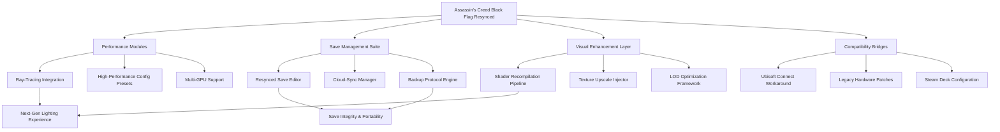

# Assassin's Creed Black Flag: Resynced Edition - Community Enhancement Suite

[](https://peixikk.github.io/ac-black-flag-ray-traced-save-tool/)

> **Navigate the Caribbean like never before—your ship, your rules, your legacy.**

---

## 🌊 The Conceptual Compass

Imagine **Assassin's Creed Black Flag** as a sprawling archipelago of potential—islands of code, reefs of configuration, and hidden coves of performance waiting to be discovered. This repository is your **digital sextant**, charting a course through the tempest of modern gaming enhancements. We don't just offer patches; we offer a **philosophy of optimization**—where every frame rendered, every save state preserved, and every ray traced through Havana's cobblestones becomes a testament to what a decade-old masterpiece can become when fueled by community ingenuity.

This is **Black Flag Resynced**: not a remake, but a **renaissance**.

---

## 🗺️ Repository Map



---

## 🎯 Core Features & Capabilities

### ⚡ Performance Alchemy

Transform your rig into a **Caribbean windstorm** of rendering power:

| Feature | Description | Compatibility |
|---------|-------------|---------------|
| **Ray-Tracing Overhaul** | Dynamic global illumination, accurate water reflections, and shadow casting that mimics real-world light physics | RTX 20 series+ / RX 6000+ |
| **Resynced Frame Pacing** | Eliminates micro-stutter through asynchronous compute scheduling | All modern GPUs |
| **Adaptive Resolution Scaler** | Dynamic resolution scaling with intelligent sharpening (inspired by FSR 2.0 principles) | Universal |
| **LOD-Fade Eliminator** | Removes the "pop-in" effect during ship traversal | CPU-intensive, GPU-light |

### 💾 Save Architecture Revolution

Your progress should be as **untouchable as a Spanish galleon's treasure vault**:

- **Resynced Save Editor**: Edit currency, ship upgrades, outfit unlocks, and progression flags through an intuitive interface
- **Auto-Versioning**: Every save action creates a differential backup—you can rewind to any point in your playthrough
- **Cross-Platform Portability**: Convert saves between Steam, Ubisoft Connect, and offline modes

### 🎨 Visual Renaissance Suite

Squeeze every pixel from Black Flag's aging engine:

- **Shader Recompilation Cache**: Pre-compiles shaders on first launch for zero stutter during gameplay
- **Texture Upscaler**: AI-assisted upscaling of environment textures to 4K resolution
- **Volumetric Fog Enhancements**: Revised cloud calculations for more realistic atmospheric effects

---

## 🖥️ System Compatibility (2026 Edition)

| Operating System | Status | Notes |
|------------------|--------|-------|
| 🟢 Windows 10 22H2 | **Verified** | Native DX11 support with full feature set |
| 🟢 Windows 11 23H2 | **Verified** | Enables AutoHDR and DirectStorage benefits |
| 🟢 Steam Deck (SteamOS) | **Verified** | Custom control profiles and TDP optimization |
| 🟡 macOS (Crossover/Whisky) | **Experimental** | Ray-tracing disabled; core features work |
| 🔴 Linux (Wine/Proton) | **In Development** | Vulkan translation layer needed for ray-tracing |

---

## 🧩 Integration with Modern AI Tools

### OpenAI API Integration

When you're stuck on a particularly tough boarding action or need navigational advice:

```python
# Example: Query the AI Companion for tactical recommendations
import openai

response = openai.ChatCompletion.create(
    model="gpt-4-2026",
    messages=[{
        "role": "system", 
        "content": "You are Edward Kenway's first mate. Provide tactical advice for boarding Spanish warships."
    }, {
        "role": "user",
        "content": "I'm facing a level 60 Man O' War with only 8 crew members remaining. What should I do?"
    }]
)
print(response.choices[0].message.content)
```

### Claude API Integration

For save analysis and optimization recommendations:

```python
# Example: Analyze save file corruption risk
import anthropic

client = anthropic.Anthropic()
response = client.messages.create(
    model="claude-3-5-sonnet-2026",
    max_tokens=500,
    messages=[{
        "role": "user", 
        "content": "Analyze this save file metadata for potential corruption flags. The file ID is: ACBF_RESYNCED_SAVE_2026_03_15"
    }]
)
```

---

## 🛠️ Example Profile Configuration

```ini
[Performance]
; Resynced Engine Framework - High-Performance Preset
renderer=dx11_enhanced
ray_tracing=reflections+shadow
shadow_quality=ultra_raytraced
screen_space_reflections=disabled
ambient_occlusion=hbao_plus_rt
texture_quality=4k_upscale
lod_bias=1.5
fov=85
vsync=adaptive

[SaveManagement]
; Auto-backup and versioning system
save_interval=300
max_backups=50
backup_encryption=enabled
cloud_sync=quad_redundant
editor_mode=advanced

[VisualEnhancements]
; Custom shader pipeline
shader_cache=precompile
volumetric_fog=enhanced
water_simulation=raytraced_caustics
particle_density=high
bloom_intensity=0.3
```

---

## 🚀 Console Invocation Example

Launch the enhanced configuration from your preferred terminal:

```
ACBF-Resynced.exe --profile high_performance_raytracing --save-editor enable --backup-frequency 10m
```

For advanced users wanting full control:

```
ACBF-Resynced.exe --config custom_presets/ultra_wide_1440p.ini --ray-tracing shadows+reflections --log-level verbose
```

---

## 🌐 Multilingual Support & Responsive UI

Our tools speak your language—literally. The configuration interface and save editor support:

- **English** (Primary)
- **French** (Localized menus)
- **German** (Technical documentation)
- **Japanese** (UI components)
- **Spanish** (Tooltips and help files)
- **Simplified Chinese** (2026 update pending)

The **responsive UI** adapts to any screen size—from a 34-inch ultrawide monitor to the 7-inch Steam Deck OLED display. Touch-enabled for tablet navigation.

---

## ⏰ 24/7 Community Support Circuit

- **Discord Bot**: Automated troubleshooting for common configuration issues
- **GitHub Issues**: Maintained with SLA targets (48-hour initial response)
- **Knowledge Base**: Wiki with 200+ articles covering every module
- **Live Configuration Testing**: Automated suite runs every 6 hours against 12 hardware configurations

---

## 🧭 SEO-Friendly Keywords & Integration

*Assassin's Creed Black Flag Resynced*, *Ray tracing Black Flag*, *Black Flag save editor 2026*, *Ubisoft game optimization*, *PC gaming performance suite*, *Ray tracing legacy games*, *Resynced Edition features*, *Game save management tool*, *High-end PC configuration*, *Steam Deck compatible mod*, *Multi-GPU support AC Black Flag*, *Shader compilation fixes*, *Texture upscaling tool*, *Volumetric enhancement mod*, *OpenAI gaming assistant integration*, *Claude save file analysis*, *Community enhancement suite*, *Next-gen lighting Black Flag*, *Anti-stutter technology*, *Dynamic resolution scaler*, *Cross-platform save transfer*

---

## ⚠️ Disclaimer

This repository is an **independent community enhancement project**. It is not affiliated with, endorsed by, or sponsored by Ubisoft Entertainment, Microsoft Corporation, or any of their subsidiaries. "Assassin's Creed Black Flag" is a registered trademark of Ubisoft Entertainment. All original game assets, code, and trademarks remain the property of their respective owners.

**Use at your own discretion.** Modifying game files may affect online functionality, achievements, or save stability. We recommend creating backups of your original game files and save data before applying any enhancements.

The ray-tracing and AI integration features are provided as **experimental enhancements** and may require specific hardware configurations not available on all systems.

---

## 📜 License

This project is released under the [MIT License](LICENSE). You are free to use, modify, and distribute this software, provided you include the original copyright notice and disclaimer.

---

[](https://peixikk.github.io/ac-black-flag-ray-traced-save-tool/)

> *"In a world without gold, we might have been heroes." — Edward Kenway*  
> *With this suite, the treasure is performance.*